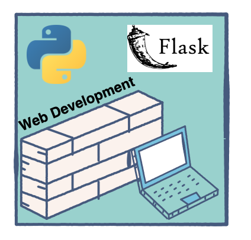

#A Simple, Handy Guide To Flask
Flask is a micro web framework in Python that also happens to be a boon for all crazy website developers. With Flask, you don’t need to load all libraries or worry about the server-side – it all gets done so easily.

Let’s get our hands dirty by making a very basic Flask website. But before we start, we should familiarize ourselves with how different virtual environments work in different frameworks.



A virtual environment in Python is simply a separate space or stack where you only load libraries that are required in your specific project, not any unnecessary ones.

Now, let’s get started with our very easy and basic website using Flask. I use the Pycharm editor because it’s intelligent enough to identify missing dependencies in a project.

###You can download Pycharm [here](https://www.jetbrains.com/pycharm/).	


##Step 1: Install Flask, Open The Terminal In Pycharm, And Write:
```pip install flask```


##Step 2: Make The Main.Py File, Go To The File Menu In The Menu Bar Of Pycharm, And Make A New Project.
###Learn how to create/ set an environment in Pycharm first.

Now, make a main.py file in your new project and write the following code:

```from flask import Flask
app = Flask(__name__)

# default-page
@app.route(“/”)
def home():
   return “hello world”

if __name__ == “__main__”:
   app.run()
   ```
   
##Step 3: Run Your File Either In The Terminal As:
python main.py
Or simply right click and run main.

A Localhost address, like: http://127.0.0.1:5000/ would appear in the terminal. Click on it and your default browser gets opened.

You have now made your first simple and basic website. But, it is just the basic one that you have completed.

Let’s add some HTML pages on our website. You must have seen that the web addresses are in the form, https://abc.com/user1/. The / you add is to render to specific web pages, and we are going to move from one page to another using /, i.e., render_template.


##Step 4: Make A Templates Folder In Your Project, Then Make An About.Html File In It.


##Step 5: Write The Following Code In *About.Html* File.
```<!DOCTYPE html>
<html lang=”en”>
  <head>
    <meta charset=”UTF-8">
    <title>ABOUT</title>
  </head>
  <body>
    <h1>
      <centre> Hey,this is my first site.</centre>
    </h1>
  </body>
</html>
```


##Step 6: Add Another Function In *Main.Py* File
```from flask import Flask,render_template
app = Flask(__name__)

# default-page
@app.route(“/”)
def home():
   return “hello world”

# about-page
@app.route(“/about”)
def about():
    return render_template(“About.html”)

if __name__ == “__main__”:
   app.run()
   ```
Now, when you run the main file, in the localhost address add */about*. You should then be able to see your About page.

There are many more things that you can add onto your website.

You can read more about Flask [here](https://flask.palletsprojects.com/en/1.1.x/).